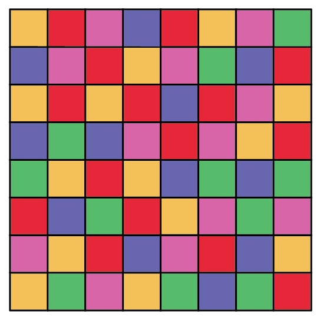

# Werkstuk technology

Vul dit document aan, en deponeer de bestanden die je gebruikte in de beschikbare mappen. Let op, lees de "info.txt" die hierin zit, beeldmateriaal moet volledig zijn. ZOrg voor voldoende foto's van je breadboard en opstelling.

## Opdracht

Maak een gezelschapspel met de arduino in het centrum. 
Elke speler begint aan een eigen kant van het spelbord met drie pionnen. Elke speler moet alle pionnen tot aan de overkant van het spelbord krijgen, als eerste.  
Elke ronde moet de speler de arduino activeren en zal de RGB led aangeven naar welke kleur de speler aan zet een van de pionnen mag verplaatsen. Er mag slechts een pion op een vakje staan.
Je kleed dit spel in hoe je het zelf kiest, hang er een verhaal aan vast en werk het uit om dit weer te geven. gebrijk karton, verf, vinyl, wat je ook nodig hebt. Het fablab opent op 15 augustus, maar je kan aan de slag met dingen die je thuis terug kan vinden.

Je arduino zal je dus moeten programeren om ervoor te zorgen dat de RGB LED een van de kleuren vanop het spelbord weergeeft. Doe dit met een delay van 3 seconden tussen de interactie en het weergeven van de kleur. Zorg dat het in lijn is met de experience die je weer wil geven.

Je mag het spel verder uitbreiden hoe je zelf wil.

# In te vullen

## Eigen informatie

- Mikolaj Buelens
- 1BaMCTA
- Groepsnaam

## Verhaal kadering

Het concept/verhaal draaid volledig rond het verkeer, spelers krijgen voertuigen als pionnen en moeten om de beurt een knop indrukken om zo 1 van de 3 kleuren te krijgen (rood, oranje, groen) wat natuurlijk gebaseerd is op een verkeerslicht, het bord is dus ook verdeeld in deze 3 kleuren hoe dichter bij groen hoe meer vakjes naar voor de speler zal kunnen zetten en hoe sneller ze bij hun bestemming geraken. Spelers kunnen met een beetje geluk een kortere weg vinden door het midden van het bord.
